### Picture 1
### x < y
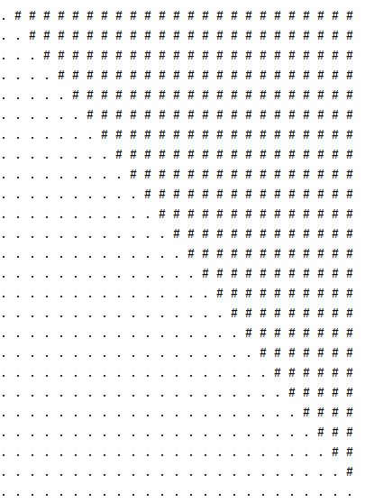

### Picture 2
### x == y
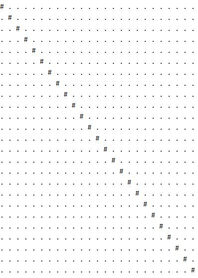

### Picture 3
### 24 - x == y
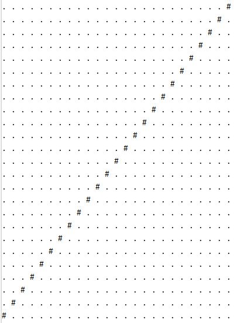

### Picture 4
### x < 29 - y
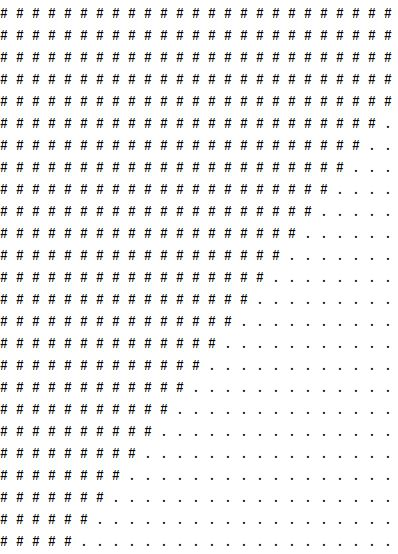

### Picture 6
### x < 10 or y < 10
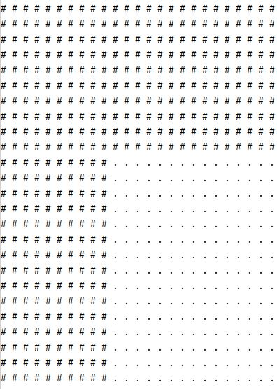

### Picture 7
### x > 15 and y > 15
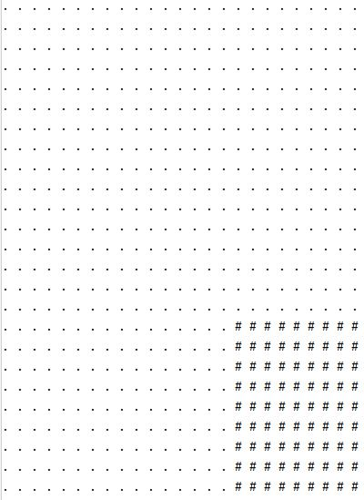

### Picture 8
### x < 1 or y < 1
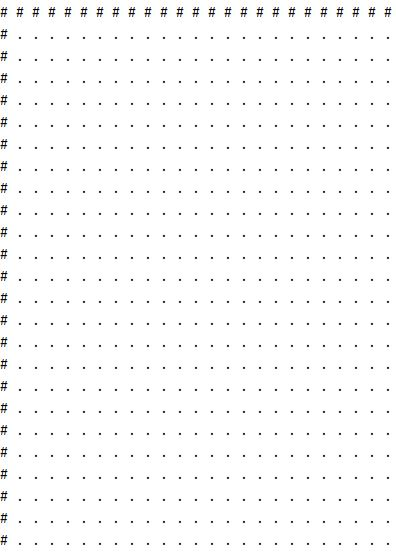

### Picture 9
### x < y - 10 or x > y + 10
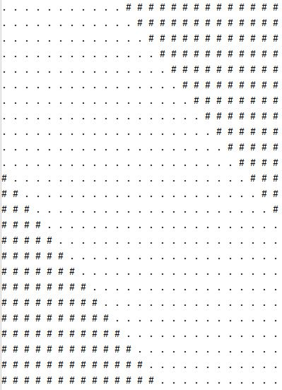

### Picture 13
### x >= 20 - y and x < 29 - y
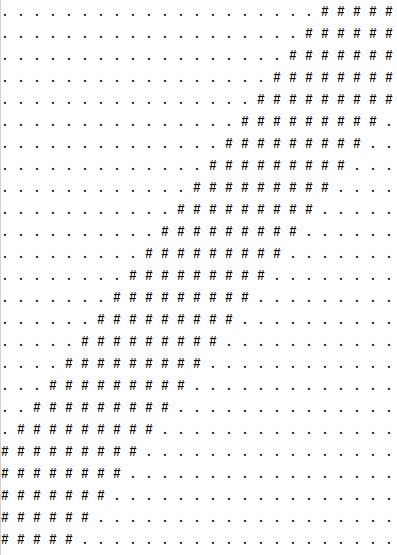

### Picture 14
### (1 / (2 * x + 1) * 50) * 2 > y-6
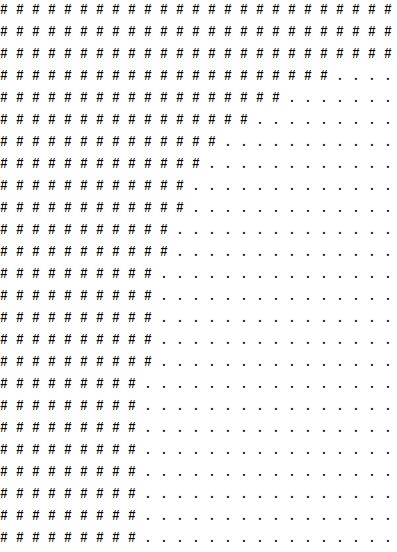

### Picture 17
### round(7.5 * sin(y / 3 + 6.2), 0) <= x - 17
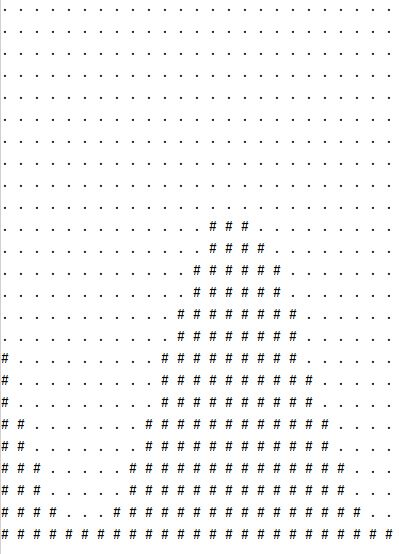

### Picture 19
### (x % 24) * (y % 24) == 0
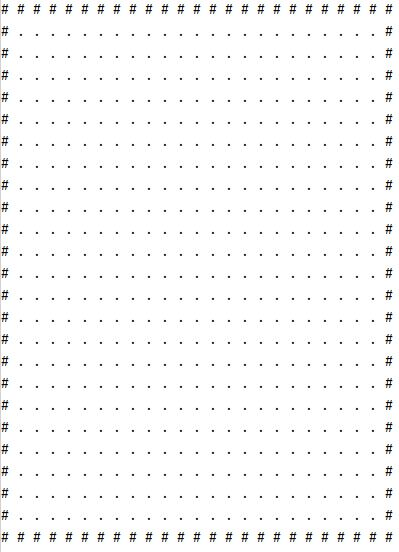

### Picture 24
### 24 - x == y or x == y
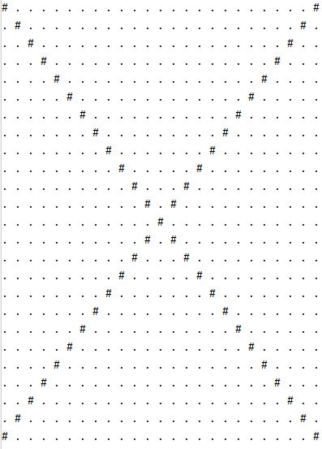

### Picture 25
### (x % 6) * (y % 6) == 0
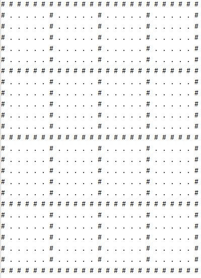

