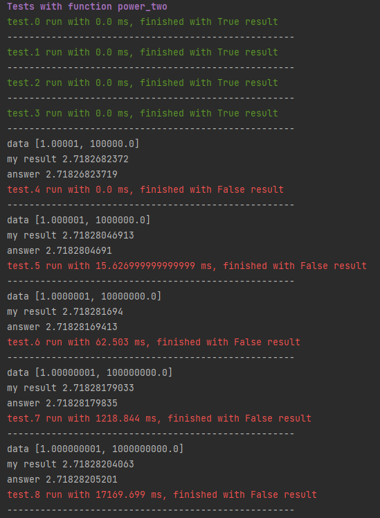
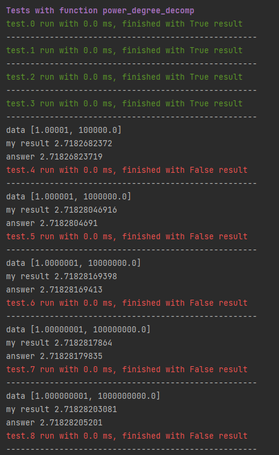

## Задача
На первой строчке записано вещественное число A > 0.
На второй строчке записано целое число N >= 0. 

Вычислить A^N. Результат вывести на экран в стандартном виде.

Решить задачу разными способами.
1. Через обычные итерации.
2. Через степень двойки с домножением.
3. Через двоичное разложение показателя степени.

### Tests
|Test №|Iterations|Power of two with a multiplies|Binary decomposition of the power value|
|---|---|---|---|
|0|0.0 ms|0.0 ms|0.0 ms|
|1|0.0 ms|0.0 ms|0.0 ms|
|2|0.0 ms|0.0 ms|0.0 ms|
|3|0.0 ms|0.0 ms|0.0 ms|
|4|2.006 ms|1.0 ms|0.0 ms|
|5|23.006 ms|11.998 ms|0.0 ms|
|6|231.006 ms|39.997 ms|0.0 ms|
|7|2306.122 ms|813.157 ms|0.0 ms|
|8|23540.106 ms|11711.694 ms|0.0 ms|

### tests fail:
#### Power of two with a multiplies

#### Binary decomposition of the power value

